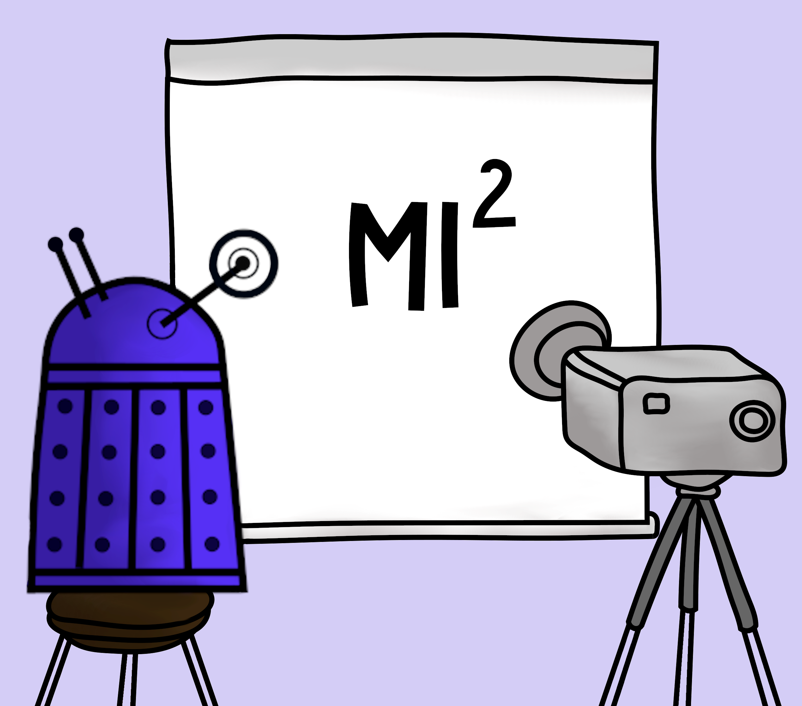

# Materials from the weekly seminar of the MI^2 group  

We meet every Monday, at 10 AM in MI^2 DataLab (room 044, Faculty of Mathematics and Information Science, Warsaw University of Technology) or online.

Join us at https://meet.drwhy.ai.

## Year 2024/2025

### Spring semester

* 24.02 - [Tracking information flow in biosystems from high-throughput data](https://github.com/MI2DataLab/MI2DataLab_Seminarium/tree/master/2025/2025_02_24_tracking_information_flow) - Miron Kursa
* 03.03 - Introduction to Sparse Autoencoders SAE with [ReLU](https://transformer-circuits.pub/2024/scaling-monosemanticity/) (Anthropic; Blog; 21.05.2024), [TopK](https://openreview.net/forum?id=tcsZt9ZNKD) (OpenAI; ICLR 2025; 06.06.2025) and [JumpReLU](https://openreview.net/forum?id=XkMrWOJhNd) (DeepMind; 09.08.2024; EMNLP 2024 Workshop) - (advising Vladimir)
* 10.03 - [Sparse Feature Circuits: Discovering and Editing Interpretable Causal Graphs in Language Models](https://openreview.net/forum?id=I4e82CIDxv) (Northeastern University; ICLR 2025; 31.03.2025) - (advising Vladimir) 
* 17.03 - [Sparse Autoencoders Do Not Find Canonical Units of Analysis](https://openreview.net/forum?id=9ca9eHNrdH) (Durham University/Independent; ICLR 2025; 07.02.2025) - (advising Vladimir)
* 24.03 - [Interpreting CLIP with Hierarchical Sparse Autoencoders](https://arxiv.org/abs/2502.20578) (My paper; Under Review; 30.01.2025) - Vladimir Zaigrajew
* 31.03 - [ProtoViT: Interpretable image classification with adaptive prototype-based vision transformers](https://openreview.net/forum?id=hjhpCJfbFG) - Paweł Gelar
* 07.04 - [PIP-Net: Patch-based intuitive prototypes for interpretable image classification](https://openaccess.thecvf.com/content/CVPR2023/html/Nauta_PIP-Net_Patch-Based_Intuitive_Prototypes_for_Interpretable_Image_Classification_CVPR_2023_paper.html) - Karol Dobiczek
* 14.04 - [Birds look like cars: Adversarial analysis of intrinsically interpretable deep learning](https://arxiv.org/abs/2503.08636) - Hubert Baniecki
* 28.04 - Vlad (ICLR)
* 05.05 - [Explaining in Diffusion: Explaining a Classifier Through Hierarchical Semantics with Text-to-Image Diffusion Models](https://arxiv.org/abs/2412.18604) - Jakub Świstak
* 12.05 - [Zero-Shot Image Restoration Using Denoising Diffusion Null-Space Model](https://github.com/MI2DataLab/MI2DataLab_Seminarium/tree/master/2025/2025_05_12_denoising_diffusion_null_space_models) - Jakub Grzywaczewski
* 19.05 - [Diffusion Posterior Sampling for General Noisy Inverse Problems](https://arxiv.org/abs/2209.14687) - Tymoteusz Kwieciński
* 26.05 - [DiG-IN: Diffusion Guidance for Investigating Networks -- Uncovering Classifier Differences Neuron Visualisations and Visual Counterfactual Explanations](https://arxiv.org/abs/2311.17833) - Dawid Płudowski
* 31.05 - Wyjazd zespołu do Wilgi
* 02.06 
* 09.06

### Fall semester

#### Schedule for the first half of the semester (track: Context matters in Deep Learning Models - Computer Vision):

* 07.10 - guest lecture by nadkom. dr Paweł Olber
* 14.10 - Do Not Explain Vision Models without Context - Paulina Tomaszewska
* 21.10 - [Positional Label for Self-Supervised Vision Transformer](https://github.com/MI2DataLab/MI2DataLab_Seminarium/tree/master/2024/2024_10_21_Positional_Label_for_Self-Supervised_Vision_Transformer) - Filip Kołodziejczyk
* 28.10 - [Adversarial examples vs. context consistency defense for object detection](https://github.com/MI2DataLab/MI2DataLab_Seminarium/tree/master/2024/2024_10_28_Adversarial_attacks_against_object_detection.md) - Hubert Baniecki
* 04.11 - [Unlocking the Power of Spatial and Temporal Information in Medical Multimodal Pre-training](https://github.com/MI2DataLab/MI2DataLab_Seminarium/tree/master/2024/2024_11_04_Unlocking_the_Power_of_Spatial_and_Temporal_Information_in_Medical_Multimodal_Pre-training) - Bartosz Kochański
* 18.11 - User study: Visual Counterfactual Explanations for Improved Model Understanding - Bartek Sobieski
* 25.11 - [Vision Transformers provably learn spatial structure](https://github.com/MI2DataLab/MI2DataLab_Seminarium/tree/master/2024/2024_11_25_Vision_Transformers_provably_learn_spatial_structure) - Vladimir Zaigrajew
* 02.12 - [Null-text Inversion for Editing Real Images using Guided Diffusion Models](https://github.com/MI2DataLab/MI2DataLab_Seminarium/tree/master/2024/2024_12_02_Null_text_optimization_for_editing_real_images) - Dawid Płudowski
* 09.12 - [Diffusion-Based Scene Graph to Image Generation with Masked Contrastive Pre-Training](https://github.com/MI2DataLab/MI2DataLab_Seminarium/tree/master/2024/2024_12_09_Diffusion_Based_Scene_Graph_to_Image_Generation_with_Masked_Contrastive_Pre_Training) - Tymoteusz Kwieciński
* 16.12 - [Rethinking Visual Counterfactual Explanations Through Region Constraint](https://github.com/MI2DataLab/MI2DataLab_Seminarium/tree/master/2024/2024_12_16_rethinking_visual_counterfactual_explanations_through_region_constraint) - Bartek Sobieski
* 13.01 - [Controlling The World by Sleight of Hand](https://github.com/MI2DataLab/MI2DataLab_Seminarium/tree/master/2025/2025_01_13_controlling_the_world_by_sleight_of_hand) - Jakub Świstak
* 20.01 - Connecting counterfactual and attributions modes of explanation - Jan Jakubik
